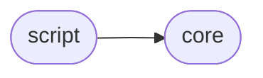
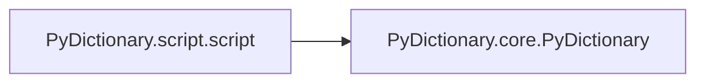

# Pydictionary Script

[_Documentation generated by Documatic_](https://www.documatic.com)

<!---Documatic-section-Codebase Structure-start--->
## Codebase Structure

<!---Documatic-block-system_architecture-start--->

<!---Documatic-block-system_architecture-end--->

# #
<!---Documatic-section-Codebase Structure-end--->

<!---Documatic-section-PyDictionary.script.script-start--->
## PyDictionary.script.script

<!---Documatic-section-script-start--->


### Object Calls

* PyDictionary.core.PyDictionary

<!---Documatic-block-PyDictionary.script.script-start--->
<details>
	<summary><code>PyDictionary.script.script</code> code snippet</summary>

```python
@click.command()
@click.option('--mode', '-m', default='meaning', help='Mode of Script [meaning, antonym, synonym]')
@click.option('--words', '-w', prompt='Enter words in a string separated by commas')
def script(words, mode):
    print('PyDictionary:')
    word_values = [w.strip() for w in words.split(',')]
    d = PyDictionary(word_values)
    maps = {'meaning': d.printMeanings, 'antonym': d.printAntonyms, 'synonym': d.printSynonyms}
    click.echo(maps[mode]())
```
</details>
<!---Documatic-block-PyDictionary.script.script-end--->
<!---Documatic-section-script-end--->

# #
<!---Documatic-section-PyDictionary.script.script-end--->

[_Documentation generated by Documatic_](https://www.documatic.com)